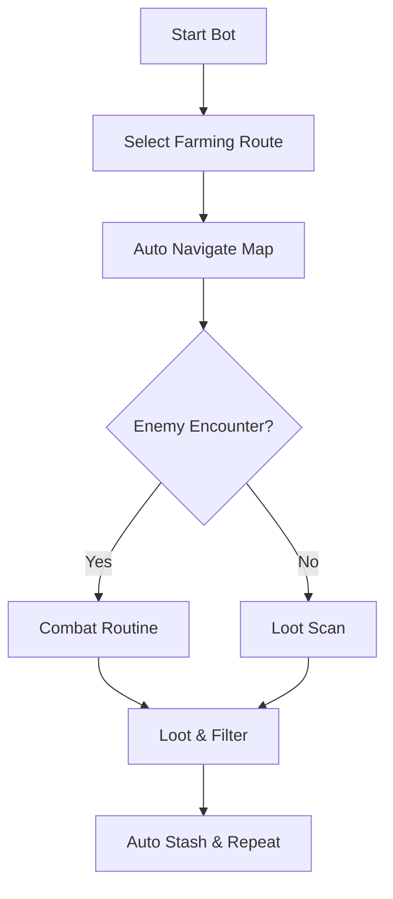

# Path of Exile 2 Farming Bot ⚙️

The **Path of Exile 2 Farming Bot Software** is designed to streamline your grind. With automated farming cycles, loot prioritization, and customizable configs, it helps you save time while focusing on strategy and build crafting.

---

## 📝 Overview

Path of Exile 2 is packed with complex loot and endless maps. Farming can be a time sink, but this bot provides **automated farming loops**, **intelligent item filters**, and **XP optimization routes** to keep your stash and levels growing efficiently.

\[!WARNING]
Automation tools should be used only for **testing and training purposes**. Back up your data before activation.

[](#)
[](#)
[](#)
[](#)

---

## ⭐ Features

* **Auto Map Clearing** – Navigates zones and eliminates enemies.
* **Loot Pickup Filters** – Grab only uniques, currency, and rares.
* **Inventory Management** – Auto-sort and stash valuable items.
* **XP Farming Routes** – Run optimized paths for leveling.
* **Config Profiles** – Save custom scripts for bosses, maps, or events.
* **Overlay Dashboard** – Monitor bot status in real time.

---

## 🖥 Compatibility

| Platform       | Supported | Notes               |
| -------------- | --------- | ------------------- |
| Windows 10/11  | ✅         | Fully supported     |
| Steam          | ✅         | Stable with overlay |
| Linux (Proton) | ⚠️        | Experimental        |
| macOS          | ❌         | Not supported       |

\[!NOTE]
Accessibility: Dashboard offers adjustable font sizes, colors, and transparency for easier monitoring.

---

## ⚡ Setup Guide

1. **Download** the bot package.
2. Extract files to your Path of Exile 2 directory.
3. Run `FarmingBot.exe` as administrator.
4. Launch PoE2 and press `F4` to start the bot overlay.
5. Configure loot filters and farming paths in the menu.

```ini
[loot]
pickup=orb,unique,rare
ignore=normal,magic

[farm]
route=maps/atlas_route.json
xp_mode=true

[hotkeys]
start=F4
pause=F5
```

---

## 🔄 Farming Workflow



---

## ❓ FAQ

**Q: Can I make my own farming routes?**
A: Yes, routes can be customized with JSON path files.

**Q: Does it auto-sell items?**
A: No, but it can auto-stash valuables. Selling is left manual for safety.

**Q: Will the bot stop at low health?**
A: Yes, safety conditions like HP thresholds can be configured.

**Q: Can it handle bosses?**
A: Basic boss combat routines are included, but best results come from farming maps.

**Q: Does it require internet?**
A: Only to run PoE2; the bot itself works offline once installed.

---

## 🚀 Final Thoughts

The **Path of Exile 2 Farming Bot Software** simplifies grind-heavy sessions with **automation, loot filters, and XP pathing**. By handling repetitive farming, it lets you focus on the builds, strategies, and trading that make PoE2 shine.

---


